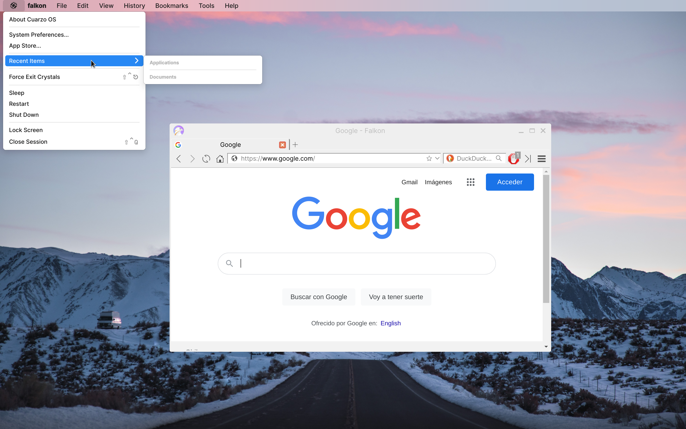
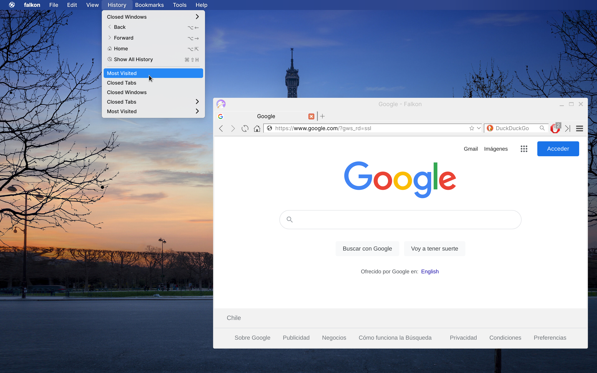

# Firmament

Global menu bar for Cuarzo OS.

## Examples

### Light Background

### Dark Background

## Features

* Uses the [Heaven](https://github.com/CuarzoSoftware/Heaven) C library.
* Automatic Qt apps support using the [QtCuarzo](https://github.com/CuarzoSoftware/QtCuarzo) platform theme plugin.
* Standard app menus.
* Blur background in Wayland using the [Crystals](https://github.com/CuarzoSoftware/Crystals) compositor.
* Gtk, EFL, and Ozone apps do not export their menus.
